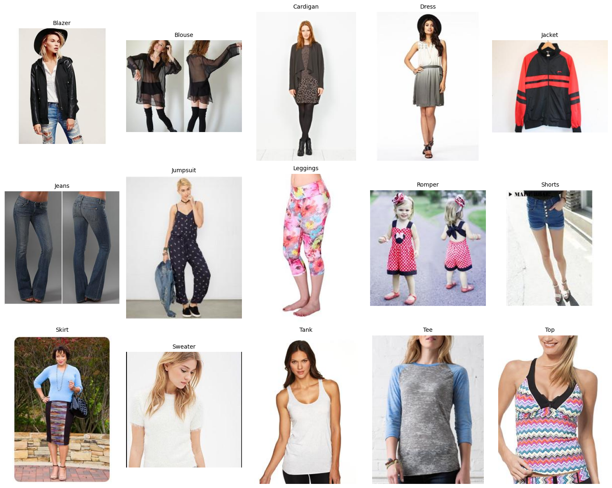
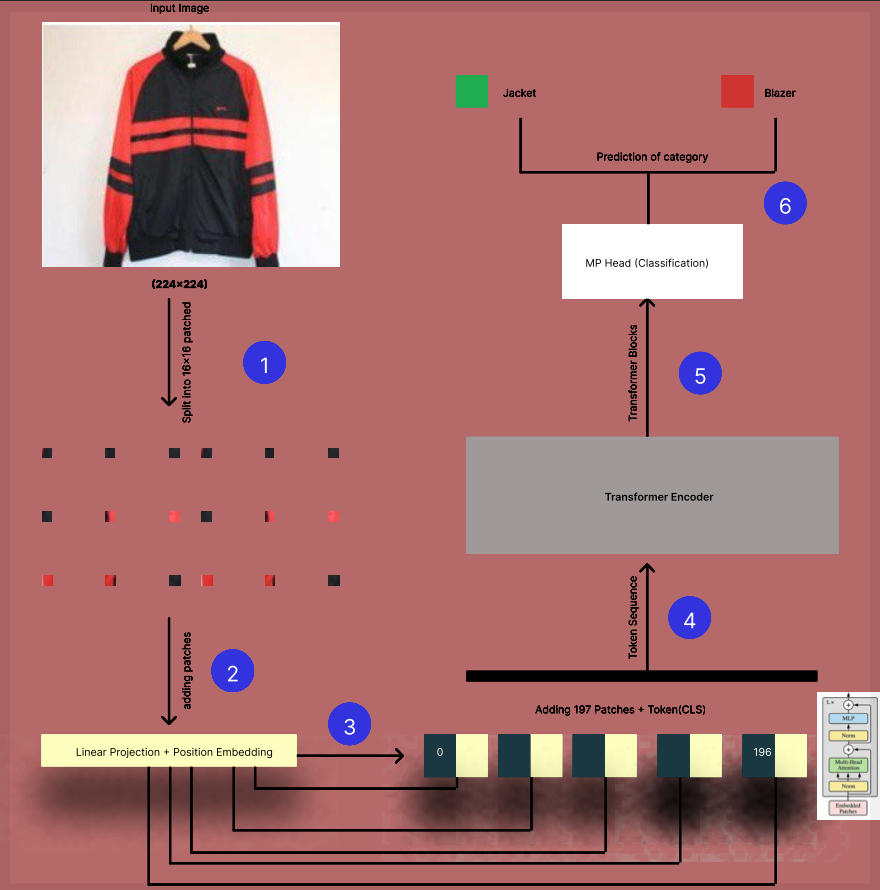

# Vision Transformer for Fashion Image Classification

A deep learning–based image classification system designed to recognize and categorize fashion items using a transformer-based architecture. 
The model leverages a Vision Transformer (ViT-Base/16) backbone, pretrained on large-scale image datasets and fine-tuned on the DeepFashion dataset 
to learn discriminative visual representations of clothing categories. The system processes images as fixed-size patches, applies multi-head self-attention 
to capture global contextual relationships, and outputs multi-class predictions across selected fashion categories.

<p align="center">


<br>
</p>

This project investigates transformer-based visual modeling for fine-grained clothing recognition while addressing challenges such as:

Class similarity (e.g., Blouse vs Top, Cardigan vs Sweater)

Noisy backgrounds

Mislabeling in real-world datasets

Overfitting on high-resolution fashion images

[](https://www.python.org/)
[](https://pytorch.org/)
[](#)
[](#)
[](https://github.com/huggingface/pytorch-image-models)
[](https://colab.research.google.com/drive/1N_n03jezm0-DfEJPdfZX6DK2ELqb7v25?usp=sharing)
[](https://mmlab.ie.cuhk.edu.hk/projects/DeepFashion.html)
[](#)
[](LICENSE)

**[View on Google Colab](https://colab.research.google.com/drive/1N_n03jezm0-DfEJPdfZX6DK2ELqb7v25?usp=sharing)**


---

## Table of Contents

1. [Overview](#overview)  
2. [Features](#features)  
3. [Architecture](#architecture)  
4. [Performance](#performance)  
6. [Dataset](#dataset)  
7. [Methodology](#methodology)    
11. [Requirements](#requirements)  
12. [Future Work](#future-work)  
13. [Citation](#citation)  
14. [License](#license)  


----


## Overview

Fashion image classification is a challenging computer vision task due to:

* Subtle differences between garments (e.g., Blouse vs Top)
* High intra-class variability
* Real-world noisy backgrounds
* Label inconsistencies

This project evaluates a **Vision Transformer (ViT-Base Patch16 224)** model on a balanced subset of the DeepFashion dataset.

### Dataset Configuration

- 15 fashion categories  
- 3,000 images per category  
- 45,000 total images  
- 80/10/10 train-validation-test split  

The objective was to examine how ViT performs on visually similar categories and detect overfitting behavior.

### Dataset Configuration

- 15 fashion categories  
- 3,000 images per category  
- 45,000 total images  
- 80/10/10 train-validation-test split  

The objective was to examine how ViT performs on visually similar categories and detect overfitting behavior.


----

## Features

* Vision Transformer (ViT-Base/16)
* Balanced multi-class dataset
* Extensive data augmentation
* Early stopping & checkpointing
* Per-class performance analysis
* Confusion matrix visualization
* Error rate breakdown per category
* Overfitting detection

---

## Architecture

### Vision Transformer Pipeline

| Stage | Component | Description |
|--------|------------|-------------|
| 1 | Image Resize | All images resized to 224×224 |
| 2 | Patch Splitting | 16×16 patches (196 total) |
| 3 | Positional Embedding | Added to patch tokens |
| 4 | Transformer Encoder | Multi-head self-attention |
| 5 | CLS Token | Global representation |
| 6 | Classification Head | Final softmax prediction |

Each image is split into **16×16 patches**, producing **197 tokens (196 patches + CLS)** before entering the transformer encoder.


<p align="center">
<a href="DeepFashion-Figures/Diagrams/ModelArchitecture.pdf">


</a>
<br>
<em>(Click image to view high-resolution PDF)</em>
</p>


---

## Performance

### Final Test Results

| Metric | Value |
|--------|--------|
| Test Accuracy | **64.9%** |
| Macro F1-Score | 0.644 |
| Weighted F1-Score | 0.644 |
| Test Samples | 4,500 |

### Strongest Categories

- Leggings – 88.7%
- Jeans – 80.0%
- Romper – 77.7%

### Weakest Categories

- Blouse – 38.7%
- Top – 39.3%
- Tee – 51.3%

Weak classes were mainly affected by visual similarity and dataset mislabeling.

---


## Dataset

This project is based on the **DeepFashion – Category & Attribute Prediction Benchmark** dataset.


### Raw Dataset (Official Source)

If you want the original dataset with full annotations:

🔗 https://mmlab.ie.cuhk.edu.hk/projects/DeepFashion.html

The original dataset contains:

- 800,000 images
- 50 clothing categories
- Bounding box annotations
- Attribute prediction benchmark

You must manually download and extract it from the official website.

### Preprocessed Dataset (Used in This Project)

For reproducibility and faster setup, we provide a preprocessed version:

🔗 https://drive.google.com/drive/folders/1BI4L2gByICU4Ewozv2driqdMkijq33Rc


### Google Drive Structure

After downloading, your Google Drive should look like this:
```
PatternRecognition-ViT/
│
├── Image/                     # DeepFashion image dataset
├── Annotation/                # Category and attribute annotations
├── Splits/                    # Predefined train/val/test splits
├── saved_model/               # Fine-tuned ViT model checkpoints
├── Figures+Tables+Workflow/   # Experimental figures and workflow diagrams
│
├── DeepFashion.ipynb          # ViT training and evaluation pipeline
├── Tables+Figures_ViT.ipynb   # Performance analysis and visualizations
└── SS25-PTR-Overleaf.pdf      # Final  documentation
```

### Selected Dataset Configuration

For this study:

- 15 selected fashion categories  
- 3,000 images per category  
- Total = 45,000 images  
- Split: 80% Train / 10% Validation / 10% Test  

The split files are stored inside the `Splits/` directory.

---

## Methodology

### Overall Pipeline

The project follows a structured end-to-end workflow from raw dataset to performance evaluation.


### Data Acquisition

- Download DeepFashion dataset
- Mount Google Drive in Colab
- Load images from `Image/`
- Load labels from `Annotation/`
- Apply label encoding

### Data Preparation

- Select 15 categories (≥ 3,000 images each)
- Sample 3,000 images per category (balanced dataset)
- Create a dataframe mapping:
  - Image path
  - Encoded label
- Shuffle dataset
- Split into:
  - 80% Training
  - 10% Validation
  - 10% Testing

Split files are stored inside `Splits/`.


### Data Augmentation & Preprocessing

All images are resized to **224×224** and augmented using:

- RandomResizedCrop
- HorizontalFlip
- RandomRotation
- RandomPerspective
- ColorJitter
- RandomAutocontrast
- Normalize (ImageNet statistics)

Three DataLoaders are created:

- `train_loader`
- `val_loader`
- `test_loader`

Batch size: 16


### Model Architecture (Vision Transformer)

Each input image undergoes:

1. Resize to 224×224
2. Split into 16×16 patches
3. Linear projection of patches
4. Add positional embeddings
5. Add CLS token (197 tokens total)
6. Pass through Transformer Encoder blocks
7. Classification head predicts category

Model used:

`vit_base_patch16_224` (timm library)


### Training Configuration

| Component         | Setting                                  |
|------------------|------------------------------------------|
| Loss Function     | CrossEntropyLoss                         |
| Optimizer         | AdamW (lr = 4e-5, weight_decay = 1e-4)   |
| Drop Rate         | 0.1 – 0.2                                |
| Scheduler         | Cosine Annealing                         |
| Early Stopping    | Patience = 5                             |
| Maximum Epochs    | 15                                       |
| Batch Size        | 16                                       |

During each epoch:

* Forward pass
* Loss computation
* Backpropagation
* Validation evaluation
* Checkpoint saving (best validation loss)

**Early stopping was triggered at epoch 8 due to overfitting.**

### Evaluation Phase

After training:

* Compute Test Accuracy
* Generate Classification Report
* Generate Confusion Matrix
* Compute per-class accuracy
* Visualize correct & incorrect predictions

Final Test Accuracy: **64.9%**

### Error Analysis

Main sources of misclassification:

- High similarity between garments (e.g., Cardigan vs Sweater)
- Subtle structural differences (e.g., Blouse vs Top)
- Mislabeling inside dataset
- Noisy backgrounds

**All results are saved in this directory [`DeepFashion-Results`](DeepFashion-Fgiures/)**


---
## Requirements

This project was developed using Python 3.8+ and the following libraries:

### Core Dependencies

- torch >= 2.0.0
- torchvision >= 0.15.0
- timm >= 0.9.0
- pandas >= 2.0.0
- scikit-learn >= 1.3.0
- matplotlib >= 3.7.0
- Pillow >= 10.0.0
- numpy >= 1.24.0


### Install All Dependencies

```bash
pip install -r requirements.txt
```
---

## Future Work

- [x] Vision Transformer (ViT-Base Patch16 224)
- [x] Balanced dataset sampling (3,000 per class)
- [x] Extensive data augmentation
- [x] Early stopping & checkpointing
- [x] Confusion matrix & classification reportfeatures)
- [x] Per-class performance analysis
- [ ] Hybrid CNN + Vision Transformer architecture for improved feature extraction
- [ ] Stronger background suppression using background segmentation (U²-Net or Mask R-CNN)
- [ ] Fashion Similarity Retrieval System
- [ ] Per-class performance analysis

---

## Citation 

If you use this project or dataset in your research, please cite the following works.


## DeepFashion Dataset

```bibtex
@inproceedings{liuLQWTcvpr16DeepFashion,
  author = {Liu, Ziwei and Luo, Ping and Qiu, Shi and Wang, Xiaogang and Tang, Xiaoou},
  title = {DeepFashion: Powering Robust Clothes Recognition and Retrieval with Rich Annotations},
  booktitle = {Proceedings of IEEE Conference on Computer Vision and Pattern Recognition (CVPR)},
  month = {June},
  year = {2016}
}
```

---

## License

```markdown

This project is licensed under the MIT License.

Permission is hereby granted, free of charge, to any person obtaining a copy
of this software and associated documentation files (the "Software"), to deal
in the Software without restriction, including without limitation the rights
to use, copy, modify, merge, publish, distribute, sublicense, and/or sell
copies of the Software, and to permit persons to whom the Software is
furnished to do so, subject to the following conditions:

The above copyright notice and this permission notice shall be included in all
copies or substantial portions of the Software.

THE SOFTWARE IS PROVIDED "AS IS", WITHOUT WARRANTY OF ANY KIND, EXPRESS OR
IMPLIED, INCLUDING BUT NOT LIMITED TO THE WARRANTIES OF MERCHANTABILITY,
FITNESS FOR A PARTICULAR PURPOSE AND NONINFRINGEMENT. IN NO EVENT SHALL THE
AUTHORS OR COPYRIGHT HOLDERS BE LIABLE FOR ANY CLAIM, DAMAGES OR OTHER
LIABILITY, WHETHER IN AN ACTION OF CONTRACT, TORT OR OTHERWISE, ARISING FROM,
OUT OF OR IN CONNECTION WITH THE SOFTWARE OR THE USE OR OTHER DEALINGS IN THE
SOFTWARE.
```
